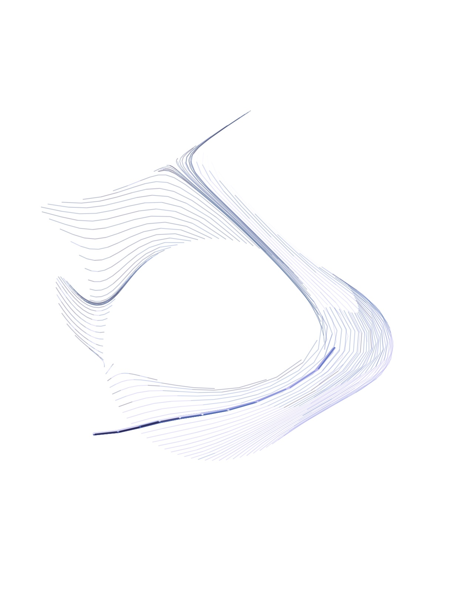
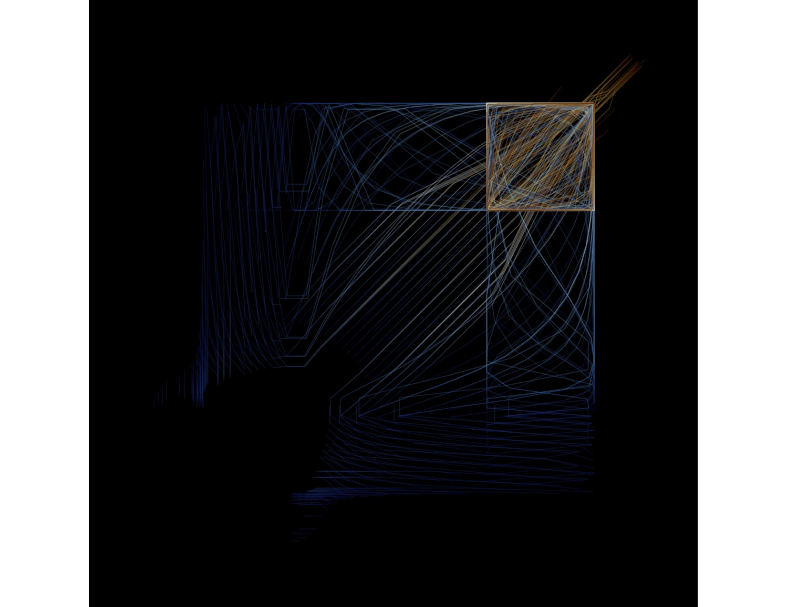
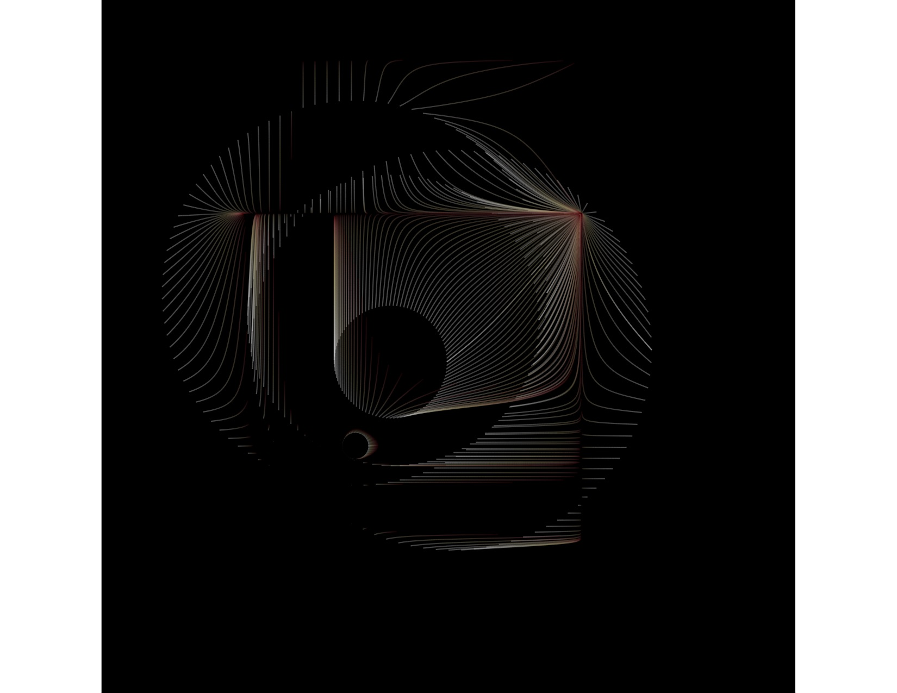

### 
 <b>Generative Art Using Rstudio
</b>

  
   
 In my spare time I like to play around with Rstudio data visualisation. All the following images were made purely by code and haven't been altered at all.

 
  
  
   
    
     
       
   

#### Packages used:
- 
- 