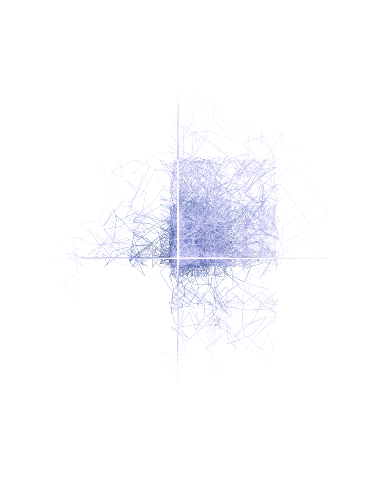
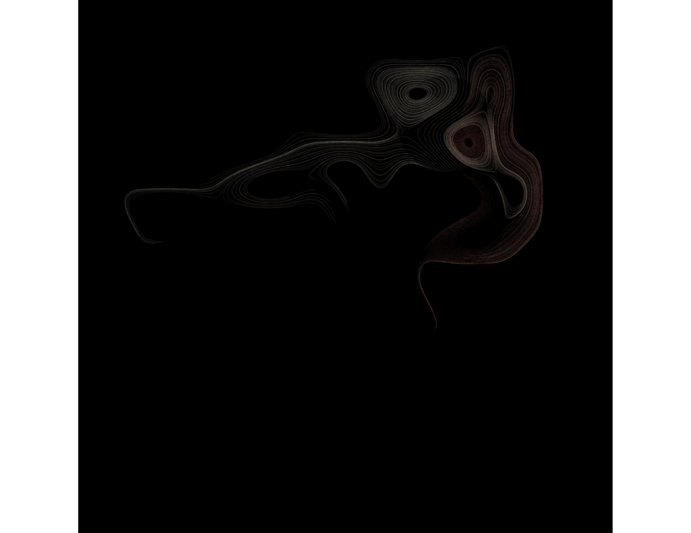

### 
 <b>Generative Art Using Rstudio
</b>

All the following images were programmed using R. I am still a notice at creating these but I am happy with my progress! 
 
  
   

 
  
  
   
  
   
   
    
    
     
     
      
       
   
  

#### Packages used:
- 
- 